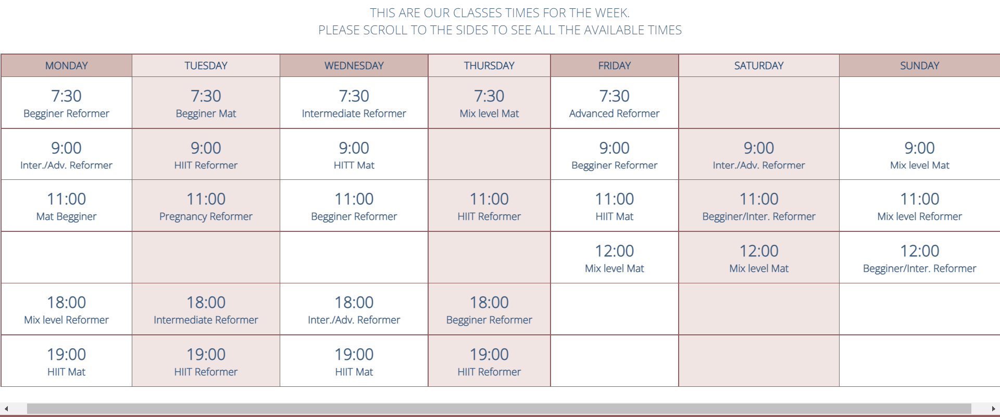

# Wellness Pilates Studio

Wellness Pilates Studio is a site for pilates lovers who are based in Dublin,Ireland, and are looking to start practising pilates or are already members of the studio and wish to take classes on a regular basis. The site has the all the information on prices, class times and location for members to now how, where and when they can attend the studio. 

## Features

The site implements very basic features of a static website.

### Existing Features
#### **Navigation Bar**

- Featured on all four pages, the full responsive navigation bar includes links to the Logo, Home page, Pricing, Schedule and Contact page and is identical in each page to allow for easy navigation.
- This section will allow the user to easily navigate from page to page across all devices without having to revert back to the previous page via the ‘back’ button.
- The navigation bar is consistent througout all pages.
- The navigation bar will transform into a vertical nav in smaller phone devices via media query.

#### **The landing page image**
- The landing includes an static photograph of a woman practising pilates.
- The picture will change in each of the pages of the website.

#### **Studio Main**
- The studio main section will allow the user to learn what is pilates, how can the benefit from practising on a regular basis.
- The user will learn about the flexibility this type of exercise allows and the excellent instructors available in the studio willing to help everyone they teach. 
- The user will see the variety of classes at their hand. This should encourage the user to consider pilates as their form of exercise.

#### **The Footer**
- The footer sections has the address and opening times of the Studio.
- The footer section also includes links to the relevant social media sites for the Wellness Pilates Studio. The links will open to a new tab to allow easy navigation for the user.
- The footer is valuable to the user as it allows them to know where, and when they can attend the Studio and also to keep connected via social media.
- The footer is consistent througout all pages.

#### **Pricing Section**
- This section will allow the user to see the exact prices on individual clases either on Mat or Reformer, and the prices and convenience of buying blocks of classes (5 blocks and 10 blocks).  
- This section will be updated as new blocks of clases and combination of mat and reformer comes available.

#### **The Schedule Section**
- This section will has a table listing with  all the classes types and times available for the user.
- The table has a vertical zebra stripes  styling to allow an easier differentiation between the days of the week.
- The times section will be updated regularly to keep the user up to date on the classes availability.
 

#### **Contact Section** 
- This page will allow the user to get in contact with the Wellness Pilates Studio. The user will be asked to submit their full name and email address and message.
- The name, surname and email fields are mandatory, the message is optional.
- Currently, submitting the form will take the user to the form dump page provided by Code Institute.
- There is a google map on this page, next to the contact section where it shows the address location of the Wellness Pilates Studio.

## Features Left to Implement
- In the future a shop online to allow the user to purchase the classes directly on the website will be added.
- Another feature to implement, would be a booking system for the user to book their own classes as they suit them. 

## Testing
- I have tested this webpage using the devtools devise tools bar to make sure it is responsive and functions on different screen sizes.
- I have make sure that the Logo, Home page, Pricing, Schedule and Contact are readable, responsive an easy to undestand.

## Bugs
- When the project was deployed I discovered that none of th pictures where working. After examing the code I discover I used and absolute path to the images. Once **../** was removed from the code the problem was fixed.

##  Validator Testing
**HTML**

No errors were returned when passing through the official [W3C validator](https://validator.w3.org/)

**CSS**

No errors were found when passing through the official [CSS validator](https://jigsaw.w3.org/css-validator/validator.html.en)

**Accessibility**

I can confirm that the fonts chosen are easy to read, I had to darken to color of some section titles to improve readability once I run it through Lighthouse in Devtools.

## Unfixed Bugs

Currently there are none unfixed bugs. 

## Deployment

The site was deployed to GitHub pages. The steps to deploy are as follows:

1. In GitHub select the repository I need to deploy, navigate to the Settings tab.
2. In the left-hand navigation section select Pages
3. From the source section drop-down menu, select the Main Branch, and click SAVE. 
4. After several minutes the website is live and will be automatically refreshed with each Git push command.

The link to the live site is: https://ygallo.github.io/wellness-pilates-studio/index.html

## Credits

- The code to make the header and nav bar was taken from CI Love Running Project

## Content
- The text for the Home page was taken from Wikipedia Article “Pilates”.
- The instruction for the pricing table where take form this Youtube Tutorial: https://www.youtube.com/watch?v=jfh0ZJFhj2w
- Fonts were taken from Google fonts.
- The icons in the footer were taken from Font Awesome
 
## Media
All the stock images were sourced from the following open source sites:
- [Pexels](https://www.pexels.com/)
- [Pixabay](https://pixabay.com/)
 

